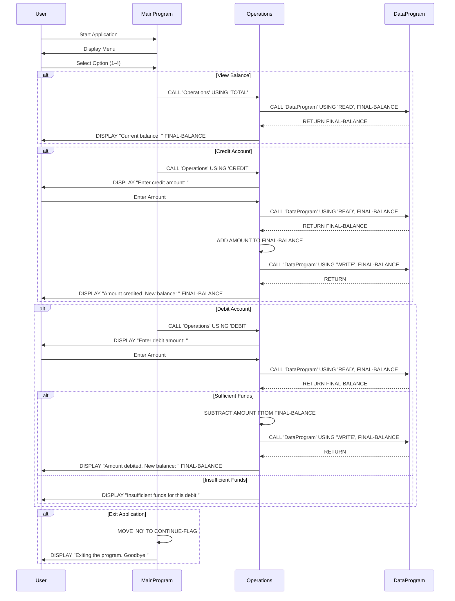

# Modernizing  a Cobol accounting system to a Node.js application using GitHub Copilot

This repo contains COBOL code for a simple accounting system. You can use GitHub Copilot to transform this code to a Node.js accounting system.

**Note: Keep in mind GitHub Copilot is an AI pair programmer that helps you write code. It is not a code generator and is using generative
models trained on public code. It may provide completions that are not perfect, safe, or otherwise suitable for production. Always review suggestions
and take a trust but verify approach.**


## 📋 Spec-Kit Structure

This repository follows the [GitHub Spec-Kit](https://github.com/github/spec-kit) framework for spec-driven development. All project specifications, plans, and tasks are documented in the `.specify/` directory:

- **[Constitution](/.specify/memory/constitution.md)**: Project principles and architectural guidelines
- **[Specification](/.specify/specs/spec.md)**: Comprehensive project requirements and user stories
- **[Implementation Plan](/.specify/specs/plan.md)**: Technical approach and implementation phases
- **[Task List](/.specify/specs/tasks.md)**: Detailed breakdown of all implementation tasks

For more information about the spec-kit structure, see [.specify/README.md](.specify/README.md).

## 🚀 Quick Start: Node.js Implementation

**The modernization is complete!** A fully functional Node.js implementation is available in the `node-accounting-app/` directory.

### Running the Node.js Application

```bash
cd node-accounting-app
npm install
npm start
```

### Features
- ✅ Complete functional equivalence with COBOL version
- ✅ Interactive console menu interface
- ✅ View balance, credit, and debit operations
- ✅ Overdraft protection
- ✅ Comprehensive test suite (13 tests passing)
- ✅ Detailed code comments referencing COBOL equivalents

For detailed documentation, see [node-accounting-app/README.md](node-accounting-app/README.md).

## Prerequisites

- Basic understanding of programming concepts.
- Basic understanding of the COBOL programming language.
- GitHub Copilot or GitHub Copilot Chat installed in your IDE or GitHub Codespace.

## Setup the development environment

### Option 1: Use an IDE that supports GitHub Copilot

- IDE options for both GitHub Copilot and Copilot Chat:
  -  Visual Studio Code
  -  Visual Studio
  -  JetBrains IDE

#### For Visual Studio Code

- Install the GitHub Copilot and GitHub Copilot Chat extensions for Visual Studio Code.
- Install the COBOL extension for Visual Studio Code.

### Option 2: Use a GitHub codespace

- Create a new codespace in this repository. </br>


- The configuration for the codespace is already set up with the required extensions.
  - GitHub Copilot
  - GitHub Copilot Chat
  - COBOL
  - Markdown All in One
  - Mermaid Markdown
  - python

## About the program

This COBOL program simulates an account management system. This program will involve multiple COBOL source files and perform various operations like crediting, debiting, viewing the balance, and even exiting the program. Here’s how you its structured:

- Main Program (main.cob): The main program will handle the user interface and call subprograms for different operations.
- Operations Program (operations.cob): This program will handle the actual operations like credit, debit, and view balance.
- Data Storage Program (data.cob): This program will manage the storage of the account balance.

## Steps to Compile and Run the Program

- Option 1: Install COBOL compiler on MaC
If you don't already have a COBOL compiler, you'll need to install one. Common COBOL compiler is GnuCOBOL: An open-source COBOL compiler. To Install , use brew:

```bash
brew install gnucobol 
```

- Option 2: Open the terminal in the GitHub codespace or Ubuntu Linux system and run the following command to install the COBOL compiler:

```bash
sudo apt-get update && \
sudo apt-get install gnucobol
```

reference: [gnucobol](https://formulae.brew.sh/formula/gnucobol)

- Compile, link and create executable: Link the object files together to create the final executable:

```bash
cobc -x main.cob operations.cob data.cob -o accountsystem
```

- Run the Program: Run the executable to start the account management system:

```bash
./accountsystem
```

## Program Interaction Example

- Program starts with user input menu

```bash
--------------------------------
Account Management System
1. View Balance
2. Credit Account
3. Debit Account
4. Exit
--------------------------------
Enter your choice (1-4): 
```

- User Chooses to View Balance:

```bash
Current balance: 1000.00
```

- User Chooses to Credit:

```bash
Enter credit amount:
200.00
Amount credited. New balance: 1200.00
```

- User Chooses to Debit:

```bash
Enter debit amount:
300.00
Amount debited. New balance: 900.00
```

- User Chooses to Exit:

```bash
Exiting the program. Goodbye!
```

## Explanation

- main.cob: This is the main interface where users select operations.
- operations.cob: It handles specific operations such as viewing, crediting, and debiting the account balance.
- data.cob: This program acts as a simple data storage, handling reading and writing of the balance.

This multi-file structure introduces modularity, making it easier to manage and extend the program. Each file has a clear responsibility, and the program flow is driven by user interaction.

### Data flow

```text
@workspace can you create a sequence diagram of the app showing the data flow of the app. Please create this in mermaid format so that I can render this in a markdown file.
```



## Generate a test plan

```text
@workspace The current Cobol app has no tests. Can you please create a test plan of current business logic that I can use to validate with business stakeholders about the current implementation.
Later I would like to use this test plan to create unit and integration tests in a node.js app. I am in the middle of transforming the current Cobol app to a node.js app.
The test plan should include the following:

1. Test Case ID
2. Test Case Description
3. Pre-conditions
4. Test Steps
5. Expected Result
6. Actual Result
7. Status (Pass/Fail)
8. Comments

Please create the test plan in a markdown table format. The test plan should cover all the business logic in the current Cobol app.
```

### Note

*You may still need follow up with another prompt to generate the markdown file format for the test plan.*

```markdown
Convert this to markdown syntax please to insert as a new file
```

## Convert files using prompt engineering best practices

### Create the Node.js project directory

```bash
mkdir node-accounting-app
cd node-accounting-app
```

### Use GitHub Copilot to convert the files iteratively

#### Convert main.cob to main.js

#### Convert operations.cob to operations.js

#### Convert data.cob to data.js

```text
Let's link all node.js files to work together in one accounting application, and then initialize, install dependencies, and run the application.
```

### Initialize a new Node.js project

```bash
npm init -y
```

### Install the Node.js app

```bash
npm install

```

### Run the Node.js app

```bash
node main.js
```

### Generate unit and integration tests

```text
@workspace I would like to create unit and integration tests cases form the test plan mentioned in
#file:TESTPLAN.md file The node.js code is in node-accounting-app folder and I am looking to generate tests
for #file:operations.js file. Use a popular testing framework and also provide all the dependencies required to run the tests.
```

## 📊 COBOL vs Node.js Comparison

### Side-by-Side Architecture

| Component | COBOL | Node.js |
|-----------|-------|---------|
| **Main Program** | main.cob (37 lines) | main.js (98 lines with comments) |
| **Operations** | operations.cob (41 lines) | operations.js (159 lines with comments) |
| **Data Layer** | data.cob (24 lines) | data.js (44 lines with comments) |
| **Testing** | Manual testing | Automated tests with Jest (13 tests) |

### Key Differences

| Aspect | COBOL | Node.js |
|--------|-------|---------|
| **I/O Model** | Synchronous ACCEPT/DISPLAY | Async readline with Promises |
| **Module System** | CALL with LINKAGE SECTION | require()/module.exports |
| **Data Storage** | WORKING-STORAGE SECTION | Module-level variables |
| **Control Flow** | PERFORM UNTIL, EVALUATE | while loops, switch statements |
| **Testing** | Manual execution | Automated unit/integration tests |
| **Dependencies** | COBOL compiler (GnuCOBOL) | Node.js runtime + Jest |

### Functional Equivalence Checklist

✅ **Menu System**: Identical menu options and display format  
✅ **Initial Balance**: Both start with $1000.00  
✅ **View Balance**: Displays balance with 2 decimal places  
✅ **Credit Operation**: Accepts input and updates balance  
✅ **Debit Operation**: Includes overdraft protection  
✅ **Error Handling**: Same "Insufficient funds" message  
✅ **Exit Behavior**: Clean shutdown with goodbye message  
✅ **User Experience**: Same prompts and interaction flow  

### Migration Benefits

1. **Testability**: Automated tests ensure correctness
2. **Maintainability**: Modern JavaScript with clear module structure
3. **Documentation**: Extensive inline comments and external docs
4. **Portability**: Runs on any platform with Node.js
5. **Extensibility**: Easy to add features like persistence, APIs, etc.

## License

This project is licensed under the MIT License - see the [LICENSE](LICENSE) file for details.
